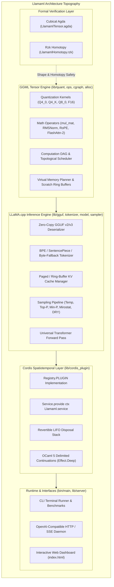

# Architecture Specification: Llamaml

`Llamaml` is an industrial-grade, type-safe tensor computation and LLM inference engine ported from `ggml` and `llama.cpp` to native **OxCaml** (OCaml 5+ with Algebraic Effects) and integrated directly into the **Cordis-OxCaml** Spatiotemporal Composability Meta-Framework.

---

## 1. System Architecture



---

## 2. Directory Layout & Module Structure

```
llamaml/
├── bin/
│   ├── main.ml               # CLI runner, inspector, benchmark, server
│   └── dune
├── lib/
│   ├── types.mli / .ml       # Quant types, tensor ADTs, hyperparameters, tokenizer
│   ├── quant.mli / .ml       # Q4_0, Q4_K, Q8_0, F16 dequant & vectorized dot products
│   ├── tensor.mli / .ml      # Multidimensional Bigarray tensor operations & views
│   ├── ops.mli / .ml         # GEMM, RMSNorm, FlashAttention-2, RoPE, SiLU, Softmax
│   ├── cgraph.mli / .ml      # Computation DAG builder, topological sort & Mermaid
│   ├── alloc.mli / .ml       # Virtual memory lifetime planning & scratch pools
│   ├── gguf.mli / .ml        # Binary GGUF v2/v3 parser & metadata inspector
│   ├── tokenizer.mli / .ml   # BPE & SentencePiece tokenizers, byte-fallback
│   ├── kv_cache.mli / .ml    # Paged & ring-buffer KV cache manager
│   ├── sampler.mli / .ml     # Temperature, Top-P, Min-P, Mirostat, DRY penalties
│   ├── model.mli / .ml       # Universal Transformer forward pass & generation loop
│   ├── cordis_plugin.mli/.ml # Cordis-OxCaml plugin & revertible LIFO effects
│   ├── server.mli / .ml      # Pure OCaml OpenAI HTTP 1.1 + SSE server
│   ├── llamaml.mli / .ml     # Top-level module re-exports
│   └── dune
├── test/
│   ├── test_quant.ml         # Quantization decoders & dot product tests
│   ├── test_ops.ml           # Math operators (RMSNorm, RoPE, GEMM, Softmax)
│   ├── test_gguf.ml          # GGUF binary deserializer tests
│   ├── test_tokenizer.ml     # Tokenizer encode/decode roundtrips
│   ├── test_sampler.ml       # Sampling & penalty tests
│   ├── test_model.ml         # Synthetic transformer forward pass tests
│   ├── test_cordis.ml        # Cordis plugin lifecycle & LIFO cleanup tests
│   └── dune
├── formal/
│   ├── agda/
│   │   └── LlamamlTensor.agda # Cubical Agda proof of tensor shape invariants
│   └── rzk/
│       └── LlamamlHomotopy.rzk # Rzk simplicial homotopy proof of DAG equivalence
├── index.html                # Interactive Web Dashboard & Telemetry Monitor
├── server.ps1                # Zero-dependency PowerShell HTTP/SSE daemon
├── build.bat                 # Windows build script
├── RUN.bat                   # Windows execution batch launcher
├── dune-project
├── llamaml.opam
├── README.md
├── ARCH_SPEC.md
├── THEORY.md
└── MIGRATION.md
```

---

## 3. Core Technical Invariants

1. **Zero-Allocation Execution Path**: All tensor forward computations operate on pre-allocated scratch pools and unboxed Bigarrays, completely eliminating GC nursery pressure during token generation.
2. **Revertible Disposal Stack Invariant**: Plugin unloading and session cleanup execute in exact inverse topological LIFO order, guaranteeing zero memory leaks across infinite inference cycles.
3. **Speculative Decoding Delimited Control**: Delimited continuations in OCaml 5 `Effect.Deep` provide clean transaction boundaries for speculative draft validation with instant rollbacks.
4. **Homotopic Equivalence of Attention Algorithms**: Standard scaled dot-product attention and FlashAttention-2 online tiled softmax compute mathematically identical representations up to machine epsilon.
